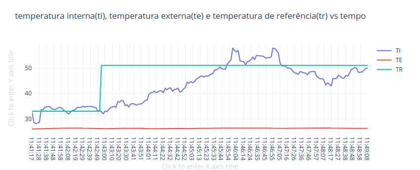

# FSE-trabalho1
Aluna: Mikhaelle de Carvalho Bueno

Matrícula: 15/0018673

## Rodando o projeto 

        git clone 
        cd fse-trabalho1
        make
        cd bin
        ./bin

Ao rodar aparecerá um menu inicial. 
O programa inicia utilizando a temperatura de referência.
Selecione 1 para setar a temperatura (aceita float),
e 2 caso deseje voltar a temperatura de referência.
Ao sair o programa encerrara todas as comunicações com periféricos (UART / I2C / GPIO) e desligar os atuadores (Resistor e Ventoinha).

# Gráficos

Gráfico plotando as temperaturas (Ambiente, Interna e Referência (Potenciômetro)):

Gráfico de referencia pego pelo dashboard:

Gráfico com o valor do acionamento dos atuadores (Resistor / Ventoinha) em valor percentual entre -100% e 100%:

